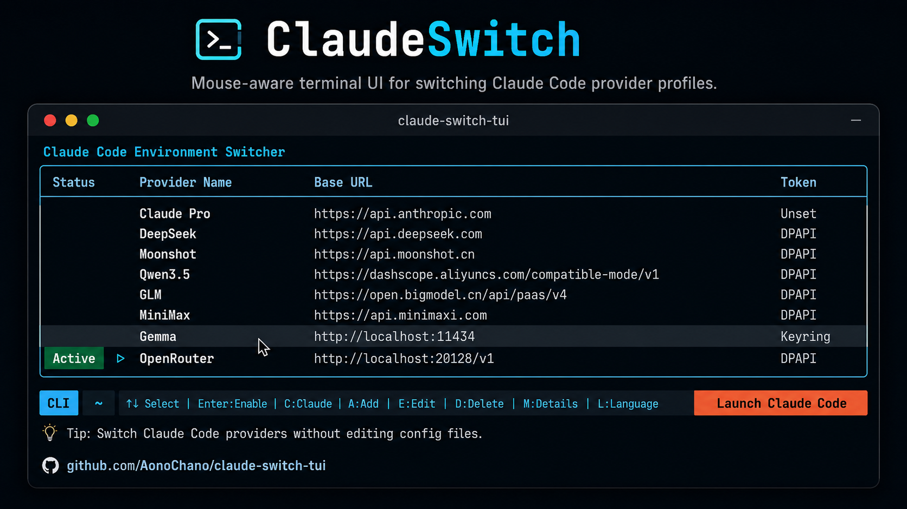

<p align="center">
  
</p>

<h1 align="center">ClaudeSwitch</h1>

<p align="center">
  Secure, multilingual terminal UI and launcher for Claude Code provider profiles.
</p>

<p align="center">
  <a href="#install">Install</a> |
  <a href="#why-this-exists">Why</a> |
  <a href="#security-model">Security</a> |
  <a href="#language-packs">Language Packs</a>
</p>

## Why this exists

Claude Code can read provider settings from local configuration, but switching profiles by editing JSON gets messy fast. API tokens make that mess risky.

ClaudeSwitch gives you a terminal UI for provider profiles, model aliases, language settings, and launching Claude Code from the current directory. It focuses on two things most switchers treat as secondary:

- Secret handling first. Tokens stay out of plaintext `settings.json` by default. Windows uses DPAPI; macOS and Linux use the system keyring when available.
- Terminal UX first. Keyboard and mouse both work: hover rows, click menu actions, edit providers in-app, switch language packs, and launch Claude Code without leaving the TUI.

It is not a proxy, router, or model gateway. ClaudeSwitch writes the local environment Claude Code already understands, then gets out of the way.

## Features

- Provider profile switching for Claude Code-compatible APIs.
- Secure profile token storage through DPAPI or system keyring.
- Plaintext-token cleanup for existing `settings.json` files.
- Mouse-aware terminal interface built on `prompt_toolkit`.
- In-app add, edit, delete, model detail, and language selection views.
- External JSON locale packs with fallback behavior for missing or partial translations.
- Translation completion display in the language picker.
- Robust width handling for CJK, Thai, Hindi, and other terminal text.
- `csw --run <profile> claude` for one-shot launches without changing the active profile.

## Install

Requirement: Python 3.10+ with `venv` support. On Windows, install Python from python.org and enable `Add python.exe to PATH`.

Windows PowerShell:

```powershell
irm https://raw.githubusercontent.com/AonoChano/claude-switch-tui/main/bootstrap.ps1 | iex
```

Open a new terminal, then run:

```powershell
csw
```

The installer creates a local virtual environment, installs dependencies from `requirements.txt`, and registers the ClaudeSwitch directory in your user `PATH`.

If installation says Python was not found or a virtual environment could not be created, install or repair Python 3.10+, open a new PowerShell, and rerun the one-line installer.

The default install directory is:

```text
%USERPROFILE%\.claude\scripts\claude-switch-tui
```

Manual install from a cloned repository still works:

```powershell
git clone https://github.com/AonoChano/claude-switch-tui.git
cd claude-switch-tui
powershell -ExecutionPolicy Bypass -File .\install.ps1
```

### Upgrade from early builds

Early builds placed `claude_switch.py`, `csw.bat`, `claude_sw.bat`, or `claude-sw.bat` directly under `%USERPROFILE%\.claude\scripts`.

The installer now migrates that setup by default:

- Removes known legacy launchers from `%USERPROFILE%\.claude\scripts`.
- Removes the old `%USERPROFILE%\.claude\scripts` entry from user `PATH`.
- Removes the old `%USERPROFILE%\.claude\scripts\ClaudeSwitch` entry from user `PATH`.
- Registers `%USERPROFILE%\.claude\scripts\claude-switch-tui` first in user `PATH`.
- Repairs PowerShell profile lines that still point to old launcher files.
- Warns when user-level `ANTHROPIC_*` environment variables are set, without printing or deleting their values.

To skip migration cleanup:

```powershell
powershell -ExecutionPolicy Bypass -File .\install.ps1 -NoLegacyCleanup
```

Manual Python run:

```powershell
python -m venv .venv
.\.venv\Scripts\python.exe -m pip install -r requirements.txt
.\.venv\Scripts\python.exe .\claude_switch.py
```

## Usage

```powershell
csw
```

Inside the TUI:

- `Enter` enables the selected profile.
- `C` launches Claude Code with the active profile in the current directory.
- `A`, `E`, and `D` add, edit, and delete providers.
- `M` opens model details.
- `L` opens language settings.
- Mouse users can click rows and menu actions; destructive actions ask for confirmation.

CLI helpers:

```powershell
csw --list
csw --run "DeepSeek" claude
csw --sanitize-settings
csw --version
csw --check-update
csw --update
```

ClaudeSwitch updates the Windows Terminal tab title while it runs. Set this before launching to disable title changes:

```powershell
$env:CLAUDE_SWITCH_SET_TITLE = "0"
```

ClaudeSwitch checks GitHub Releases for updates at most once per day on TUI startup. It ignores normal commits on `main`; only release tags like `v0.1.1` count as versions. Disable startup checks with:

```powershell
$env:CLAUDE_SWITCH_NO_UPDATE_CHECK = "1"
```

## Security Model

ClaudeSwitch protects against copied configuration files and accidental plaintext token leaks. It does not claim to protect secrets from malware already running as your user account.

Default behavior:

- New profile tokens are saved through the current secure backend.
- `settings.json` does not receive plaintext API tokens.
- Existing plaintext tokens in `settings.json` can be removed with `csw --sanitize-settings`.
- Claude Code receives the selected token through the process environment only when launched.

Backend behavior:

- Windows: DPAPI, tied to the current Windows user.
- macOS/Linux: Python `keyring`, backed by the system keychain/keyring when available.
- No secure backend: ClaudeSwitch refuses to save new plaintext profile tokens unless you opt in.

Escape hatches for debugging or migration:

```powershell
$env:CLAUDE_SWITCH_WRITE_PLAINTEXT_TOKEN = "1"
$env:CLAUDE_SWITCH_ALLOW_UNSAFE_PROFILE_TOKEN = "1"
```

Use those only when you understand the tradeoff.

## Language Packs

Language files live in `locales/*.json`. ClaudeSwitch can follow the system language, fall back to a same-language variant, then fall back to Simplified Chinese when a key is missing.

Current language packs include Chinese, English, Japanese, Korean, Russian, German, French, Spanish, Italian, Portuguese, Hindi, and Thai.

To translate a new language, use `locales/TRANSLATION_PROMPT.md` with `locales/zh-CN.json` as the source. Keep placeholders, command names, JSON keys, and `tip_terms` intact.

## Screenshots and GIFs

For the GitHub page, a short GIF or polished screenshot will show the real value better:

- Move through providers with the keyboard.
- Hover and click menu actions with the mouse.
- Open the edit form and language picker.
- Launch Claude Code from the current directory.

A 12-18 second loop is enough. Keep real API tokens and provider-specific private names out of the recording.

## Project Status

Current version: `0.1.1`

The project is early but usable. The next useful polish items are locale validation commands, cross-platform installer scripts, and real release screenshots.

## License

MIT

## Author

Built by [AonoChano](https://github.com/AonoChano).

This project is not affiliated with Anthropic.
